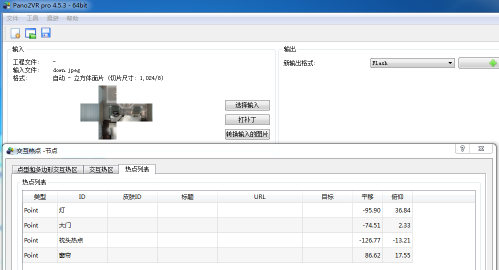
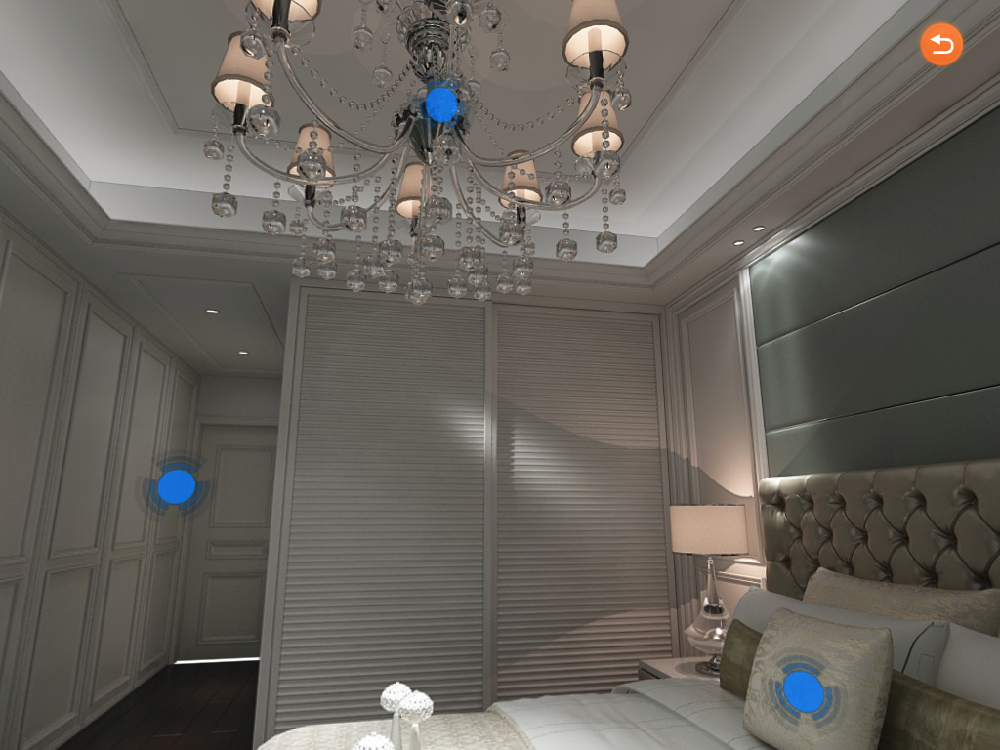

## iOS开发之720度全景展示 & 序列帧动画展示

#### [Panorama效果演示]


#### [序列帧效果演示]


###### 这里说明一点，请大神勿喷，使用了网上扒来的资源，网上也有更好的框架，可惜人家挂淘宝卖，我们穷人买不起
###### 我也不知道为什么一旦使用预编译文件就会报错，最后我的项目也不得不在基类去导入要使用的各种框架，请知道原因的发个说明给我，谢谢！
##### 测试Demo所涉及资源均来自网上，所以请勿将图片素材资源商用，谢谢
> 什么叫全景展示？序列帧动画又是什么鬼？

	1、全景展示就是利用一张球型的全景图片亦或6张不同方向的图片，组成一个球型或正方体
	2、序列帧动画就相对简单了，无非就是控制很多很多张图片跑起来所展现出来的动画当然这些动画都是专业人员用模型渲染出来的图片

> 这里我的全景展示所用到的框架就是很古老的PanoramaGL框架了，该框架使用的是手动内存管理，我也是到处扒文才搞好的，由于项目是iPad项目，没有适配手机版，所以这里也只展示iPad版本的代码
	
	1、PanoramaGL 这个框架呢由于是使用的手动管理内存，而我们平时做项目基本上都是自动管理内存
	2、所以当把这个框架导入我们工程的时候往往是有很多的报错的，所以这个时候我们就要给它添加 “-fno-objc-arc”
	3、添加方法也很简单，就是在 Build Phasesv 中的 Compile Sources 挨个给PanoramaGL 框架文件添加“-fno-objc-arc”
	4、具体如图所示：


#### [添加-fno-objc-arc示例]


#### 定位热点方法
```
本人愚昧，真心不知道别人的热点是怎么找出来的，所以在咨询过网友后，得知可以使用Windows下的Pano2VR软件进行热点定位
可能图片的方向不同，我这里定位出来的热点应用热点要把x,y值交换。
代码：
    //Pano2VR 灯定位（-95.90, 36.84）
    PLHotspot *hotspot = [PLHotspot hotspotWithId:1 texture:hotspotTexture atv:36.84 ath:95.90 width:0.05 height:0.05];
    [panorama addHotspot:hotspot];

    //Pano2VR 大门定位（-74.51, 2.33）
    PLHotspot *hotspot2 = [PLHotspot hotspotWithId:1 texture:hotspotTexture atv:2.33 ath:74.51 width:0.05 height:0.05];
    [panorama addHotspot:hotspot2];

    //Pano2VR 枕头定位（-126.77, -13.21）
    PLHotspot *hotspot3 = [PLHotspot hotspotWithId:1 texture:hotspotTexture atv:-13.21 ath:126.77 width:0.05 height:0.05];
    [panorama addHotspot:hotspot3];
    
    //Pano2VR 窗帘定位（86.62, 17.55）
    PLHotspot *hotspot4 = [PLHotspot hotspotWithId:1 texture:hotspotTexture atv:17.55 ath:-86.62 width:0.05 height:0.05];
    [panorama addHotspot:hotspot4];

定位方式：将6方图（也可以是单张全景图）导入Pano2VR软件后，进行热点定位
定位拿到平移与仰视的坐标，如：（-95, 36.84） ==> （36.84, 95.）
在PanoramaGL 框架中应用时将xy坐标反置，并且x取反，如（x, y）==> (y, -x)
热点定位效果如图所示：
	
```
##### Pano2VR软件热点坐标：


##### 框架内实际应用效果：

	
##### [Demo具体应用展示 GitHub传送门](https://github.com/90candy/Panoramic-Sequence.git)


	
