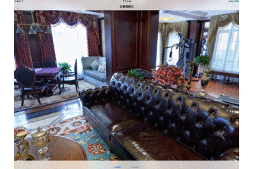
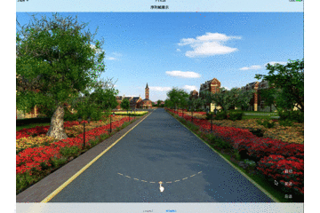
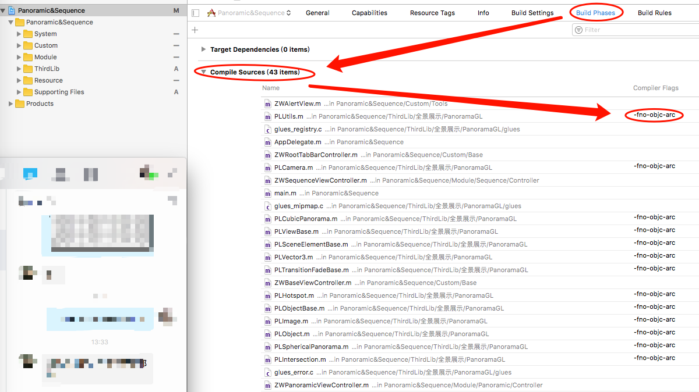

## iOS开发之720度全景展示 & 序列帧动画展示

#### [Panorama效果演示]

#### [序列帧效果演示]

###### 这里说明一点，请大神勿喷，使用了网上扒来的资源，网上也有更好的框架，可惜人家挂淘宝卖，我们穷人买不起
###### 我也不知道为什么一旦使用预编译文件就会报错，最后我的项目也不得不在基类去导入要使用的各种框架，请知道原因的发个说明给我，谢谢！
##### 测试Demo所涉及资源均来自网上，所以请勿将图片素材资源商用，谢谢
> 什么叫全景展示？序列帧动画又是什么鬼？

	1、全景展示就是利用一张球型的全景图片亦或6张不同方向的图片，组成一个球型或正方体
	2、序列帧动画就相对简单了，无非就是控制很多很多张图片跑起来所展现出来的动画当然这些动画都是专业人员用模型渲染出来的图片

> 这里我的全景展示所用到的框架就是很古老的PanoramaGL框架了，该框架使用的是手动内存管理，我也是到处扒文才搞好的，由于项目是iPad项目，没有适配手机版，所以这里也只展示iPad版本的代码
	
	1、PanoramaGL 这个框架呢由于是使用的手动管理内存，而我们平时做项目基本上都是自动管理内存
	2、所以当把这个框架导入我们工程的时候往往是有很多的报错的，所以这个时候我们就要给它添加 “-fno-objc-arc”
	3、添加方法也很简单，就是在 Build Phasesv 中的 Compile Sources 挨个给PanoramaGL 框架文件添加“-fno-objc-arc”
	4、具体如图所示：

#### [添加-fno-objc-arc示例]

	
##### [Demo具体应用展示 GitHub传送门](http://www.90candy.com)

	